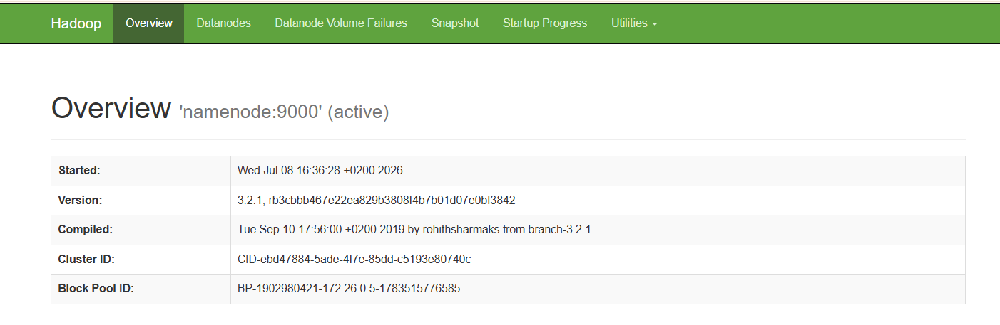
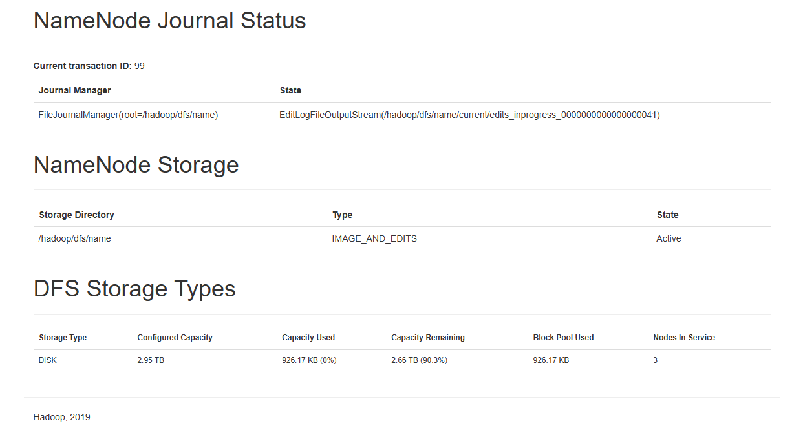
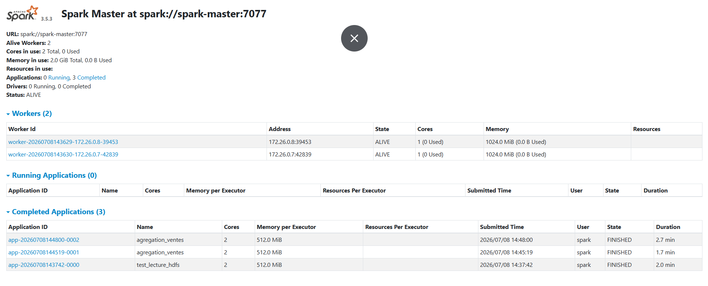
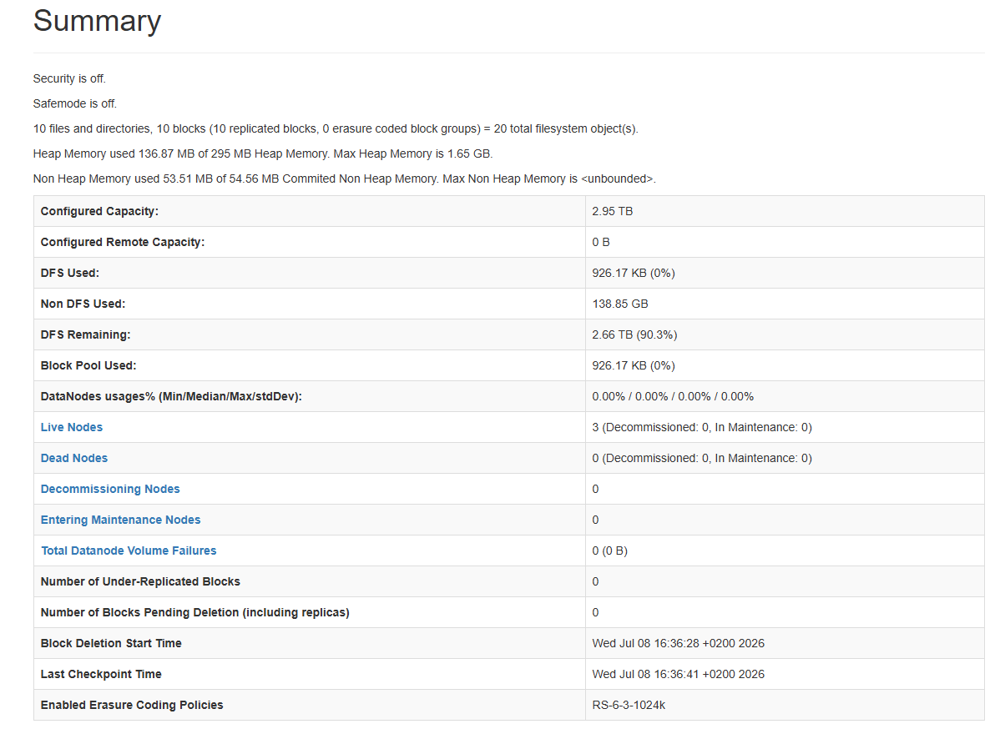

# TP3 : L'entrepot resilient (HDFS et Spark)

Dans ce TP je remplace le stockage local des journaux de commandes d'une plateforme e commerce par un cluster HDFS distribue et tolerant aux pannes. Un cluster Spark standalone, branche sur le meme reseau Docker, lit et ecrit directement dans HDFS sans passer par un volume partage ni par un chemin local.

## Prerequis

1. Docker Desktop avec Docker Compose
2. Python 3 sur la machine hote

## Etape 1 : generation des donnees sur la machine hote

Le script `generation_donnees.py` reprend le code fourni dans le sujet. Il tourne sur ma machine hote, pas dans un conteneur. La seed 7 garantit que les donnees sont reproductibles.

```
python generation_donnees.py
```

J'obtiens trois fichiers de 1000 lignes chacun :

1. `commandes_2026-06-12.csv`
2. `commandes_2026-06-13.csv`
3. `commandes_2026-06-14.csv`

Chaque ligne contient les colonnes id_commande, date, client_id, produit, categorie, quantite, prix_unitaire et entrepot. Ces fichiers ne sont pas versionnes dans le git puisqu'ils se regenerent a l'identique avec le script.

## Etape 2 : cluster HDFS avec Docker Compose

Le fichier `docker-compose.yml` decrit le cluster de stockage. Il contient un namenode qui gere les metadonnees du systeme de fichiers et trois datanodes qui stockent physiquement les blocs. Tous les conteneurs sont relies au reseau bridge `entrepot_net`, celui sur lequel je brancherai aussi le cluster Spark. J'utilise les images `bde2020/hadoop` en version Hadoop 3.2.1 car elles se configurent entierement par variables d'environnement.

Toute la configuration Hadoop est centralisee dans `hadoop.env`. Les points importants :

1. `fs.defaultFS` vaut `hdfs://namenode:9000`, c'est l'adresse que les clients HDFS et Spark utiliseront a l'interieur du reseau Docker.
2. `dfs.replication` vaut 3, chaque bloc est donc copie sur les trois datanodes, ce qui repond a l'exigence de tolerance aux pannes du sujet.
3. `dfs.blocksize` est abaisse a 32 Ko. La taille par defaut est de 128 Mo alors que mes fichiers font environ 76 Ko, chaque fichier tiendrait donc dans un seul bloc et je ne pourrais pas montrer de vrai decoupage. Avec 32 Ko chaque CSV se decoupe en 3 blocs. Je dois aussi abaisser `dfs.namenode.fs-limits.min-block-size` car HDFS refuse par defaut une taille de bloc sous 1 Mo.
4. Les options `dfs.client.use.datanode.hostname` et `dfs.datanode.use.datanode.hostname` forcent l'usage des noms de conteneurs plutot que des adresses IP internes, ce qui evite les problemes de resolution quand un client contacte directement un datanode.

Seul le port 9870 de l'interface web du namenode est publie sur la machine hote. Je ne publie pas le port RPC 9000 car il etait deja occupe sur ma machine et il ne sert qu'aux echanges internes entre conteneurs, Spark y accedera par le reseau Docker.

Demarrage du cluster :

```
docker compose up -d
docker compose ps
```

Verification que les trois datanodes sont bien enregistres aupres du namenode :

```
docker exec namenode hdfs dfsadmin -report
```

Le rapport affiche `Live datanodes (3)` avec datanode1, datanode2 et datanode3. Je verifie aussi que ma configuration est prise en compte :

```
docker exec namenode hdfs getconf -confKey dfs.replication
docker exec namenode hdfs getconf -confKey dfs.blocksize
docker exec namenode hdfs getconf -confKey fs.defaultFS
```

J'obtiens 3, 32768 et hdfs://namenode:9000. L'interface web du namenode est accessible sur http://localhost:9870 et l'onglet Datanodes montre les trois noeuds vivants.





## Etape 3 : chargement des fichiers dans HDFS

Les CSV sont sur ma machine hote et le sujet interdit le simple partage par volume. Je copie donc les fichiers dans le conteneur du namenode avec docker cp puis je les charge dans HDFS avec la commande hdfs dfs. C'est cette deuxieme commande qui fait le vrai travail : le client HDFS decoupe chaque fichier en blocs et le namenode orchestre leur replication sur les datanodes.

```
docker cp commandes_2026-06-12.csv namenode:/tmp/
docker cp commandes_2026-06-13.csv namenode:/tmp/
docker cp commandes_2026-06-14.csv namenode:/tmp/
docker exec namenode hdfs dfs -mkdir -p /data/commandes
docker exec namenode sh -c "hdfs dfs -put -f /tmp/commandes_*.csv /data/commandes/"
docker exec namenode hdfs dfs -ls /data/commandes
```

Le listing confirme la presence des trois fichiers avec un facteur de replication de 3 :

```
Found 3 items
-rw-r--r--   3 root supergroup      76353 2026-07-08 13:07 /data/commandes/commandes_2026-06-12.csv
-rw-r--r--   3 root supergroup      76582 2026-07-08 13:07 /data/commandes/commandes_2026-06-13.csv
-rw-r--r--   3 root supergroup      76371 2026-07-08 13:07 /data/commandes/commandes_2026-06-14.csv
```

Pour prouver le decoupage en blocs et leur repartition je lance fsck :

```
docker exec namenode hdfs fsck /data/commandes -files -blocks -locations
```

La sortie complete est archivee dans `preuves/etape3_fsck_apres_chargement.txt`. Ce qu'elle montre :

1. Chaque fichier de 76 Ko est decoupe en 3 blocs, deux blocs pleins de 32768 octets et un dernier bloc plus petit qui porte le reste.
2. Chaque bloc affiche Live_repl=3 avec les adresses des trois datanodes qui en detiennent une copie.
3. Le resume global annonce 9 blocs valides, une replication moyenne de 3.0, aucun bloc manquant ni sous replique, et le statut HEALTHY.

Extrait pour le premier fichier :

```
/data/commandes/commandes_2026-06-12.csv 76353 bytes, replicated: replication=3, 3 block(s):  OK
0. blk_1073741825_1001 len=32768 Live_repl=3 [172.26.0.3:9866, 172.26.0.4:9866, 172.26.0.2:9866]
1. blk_1073741826_1002 len=32768 Live_repl=3 [172.26.0.4:9866, 172.26.0.3:9866, 172.26.0.2:9866]
2. blk_1073741827_1003 len=10817 Live_repl=3 [172.26.0.3:9866, 172.26.0.4:9866, 172.26.0.2:9866]
```

Chaque bloc existe donc bien sur les trois datanodes a la fois, la perte d'un noeud ne fait perdre aucune donnee.

## Etape 4 : cluster Spark standalone sur le meme reseau

J'ajoute au docker compose un master Spark et deux workers avec l'image officielle apache/spark en version 3.5.3. Les trois conteneurs rejoignent le reseau entrepot_net, le meme que le cluster HDFS, ce qui permet a Spark de resoudre le nom namenode et de lire ou ecrire directement en hdfs://namenode:9000. Aucun volume n'est monte sur les conteneurs Spark, c'est le point exige par le sujet : rien ne transite par un chemin local ni par un volume partage.

L'image officielle ne demarre aucun processus toute seule, je lance donc moi meme les classes du mode standalone. Le master ecoute sur le port 7077 et son interface web sort sur le port 8081 de ma machine car le 8080 etait deja occupe par un autre projet. Chaque worker s'enregistre aupres de spark://spark-master:7077 avec un coeur et un gigaoctet de memoire.

```
docker compose up -d
```

L'interface http://localhost:8081 montre le master avec ses deux workers en etat ALIVE. On y voit aussi l'historique des applications terminees, mon test de lecture puis les deux executions du job d'agregation, toutes en etat FINISHED.



Je valide ensuite la lecture directe de HDFS depuis le cluster :

```
docker exec spark-master /opt/spark/bin/spark-submit --master spark://spark-master:7077 /tmp/test_lecture.py
```

Le test lit hdfs://namenode:9000/data/commandes et retourne 3000 lignes, soit mes trois fichiers de 1000 commandes lus en un seul DataFrame reparti sur 2 partitions.

## Etape 5 : job d'agregation et ecriture Parquet dans HDFS

Le job `jobs/agregation_ventes.py` fait tout le travail demande. Je declare un schema explicite avec StructType pour typer correctement chaque colonne, date en DateType, quantite en IntegerType, prix_unitaire en DoubleType, plutot que de laisser l'inference tout mettre en chaine de caracteres. Je lis les trois CSV en un seul DataFrame, je calcule le montant de chaque commande, puis je groupe par entrepot et par date pour obtenir le chiffre d'affaires total, le nombre de commandes et le panier moyen. Le resultat est ecrit au format Parquet dans hdfs://namenode:9000/resultats/ventes_agregees.

Execution :

```
docker cp jobs/agregation_ventes.py spark-master:/tmp/agregation_ventes.py
docker exec spark-master /opt/spark/bin/spark-submit --master spark://spark-master:7077 --driver-memory 512m --executor-memory 512m /tmp/agregation_ventes.py
```

Resultat obtenu :

```
+-------------+----------+----------------+------------+------------+
|entrepot     |date      |chiffre_affaires|nb_commandes|panier_moyen|
+-------------+----------+----------------+------------+------------+
|Entrepot Est |2026-06-12|69854.32        |195         |358.23      |
|Entrepot Est |2026-06-13|62843.82        |213         |295.04      |
|Entrepot Est |2026-06-14|65872.82        |189         |348.53      |
|Entrepot Nord|2026-06-12|165671.71       |493         |336.05      |
|Entrepot Nord|2026-06-13|196025.72       |515         |380.63      |
|Entrepot Nord|2026-06-14|188460.49       |501         |376.17      |
|Entrepot Sud |2026-06-12|97317.95        |312         |311.92      |
|Entrepot Sud |2026-06-13|100965.93       |272         |371.2       |
|Entrepot Sud |2026-06-14|112708.42       |310         |363.58      |
+-------------+----------+----------------+------------+------------+
```

La repartition du chiffre d'affaires colle aux poids du generateur, environ la moitie pour le Nord, un tiers pour le Sud et un cinquieme pour l'Est. Je verifie la presence du Parquet dans HDFS :

```
docker exec namenode hdfs dfs -ls /resultats/ventes_agregees
```

Le repertoire contient le fichier _SUCCESS et un fichier part en snappy.parquet, ecrits avec une replication de 3.

## Etape 6 : tolerance aux pannes, arret d'un datanode pendant un job

La preuve de replication avant la panne est le fichier `preuves/etape3_fsck_apres_chargement.txt`, chaque bloc y affiche Live_repl=3. J'arrete ensuite un datanode puis je relance le job d'agregation pendant que le cluster est ampute d'un noeud :

```
docker stop datanode3
docker exec spark-master /opt/spark/bin/spark-submit --master spark://spark-master:7077 --driver-memory 512m --executor-memory 512m /tmp/agregation_ventes.py
```

Le job reussit et produit exactement les memes agregats. Il ne peut pas echouer pour cause de donnees manquantes : chaque bloc des CSV existe en trois exemplaires, donc meme sans datanode3 le client Spark trouve toujours une replique vivante sur datanode1 ou datanode2. Quand une lecture tombe sur le noeud mort, le client HDFS bascule simplement sur une autre replique et le job continue.

La preuve apres la panne est dans `preuves/etape6_fsck_apres_panne.txt`, capturee juste apres le job. On y voit :

1. Le nouveau fichier Parquet ecrit pendant la panne est signale Under replicated, la cible est 3 repliques mais il n'en a qu'une vivante, le cluster n'avait plus assez de noeuds pour tenir le facteur 3 au moment de l'ecriture.
2. La replication moyenne du cluster est tombee de 3.0 a 2.8.
3. Le statut global reste HEALTHY, aucun bloc n'est manquant ni corrompu, seules des repliques manquent.

C'est exactement le comportement attendu d'HDFS : la panne d'un datanode ne fait rien perdre tant que le facteur de replication est superieur au nombre de noeuds perdus. Une fois le delai de detection passe, le namenode declare le noeud mort et reconstruit automatiquement les repliques manquantes sur les noeuds restants. Apres redemarrage de datanode3 avec docker start, les blocs sous repliques retrouvent leurs trois copies.

La capture suivante, prise apres le redemarrage de datanode3, montre le cluster revenu a la normale : 3 noeuds vivants, aucun noeud mort, 10 blocs au total en comptant le parquet, et plus aucun bloc sous replique.



## Bilan

Le stockage ne depend plus du disque d'une seule machine. Les journaux sont decoupes en blocs et tripliques sur un cluster HDFS, Spark lit et ecrit directement en hdfs:// a travers le reseau Docker, les rapports agreges sont disponibles en Parquet dans HDFS, et la perte d'un datanode ne fait ni echouer les jobs ni perdre de donnees.
